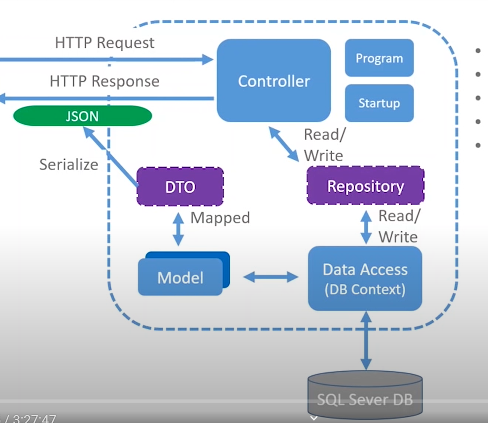

# Commander API

App architecture

---

## Description

A very simple API with the basic CRUD endpoints. Doing when learning ASP.NET with the following excelent course from Les Jackson.

[Youtube - Les Jackson - .NET Core 3.1 MVC REST API - Full Course](https://www.youtube.com/watch?v=fmvcAzHpsk8&ab_channel=LesJackson)

[Les Jackson - GitHub repository ](https://github.com/binarythistle/S03E02---.NET-Core-3.1-MVC-REST-API)

#### Technologies

- .NET CORE
- SQL
- Entity Framework
- AutoMapper

---

## How To Use

#### Installation
To run the application clone the repository, build de app, fill appsettings.json with your db instance in Data Source. Run the migrations and finally run the application.

#### Using the app
The app was documented with swagger open api. Once the app is running go to root localhost/swagger in my case https://localhost:44358/swagger/

---

## Author Info

- Linkedin - [Federico Andrés Jácome Castañeda](https://www.linkedin.com/in/federicojacome/)
- Website - [Portfolio](http://fedeandresdeveloper.online/)

[Back To The Top](#read-me-template)
